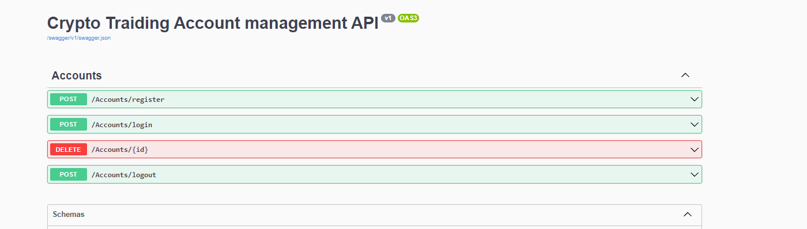
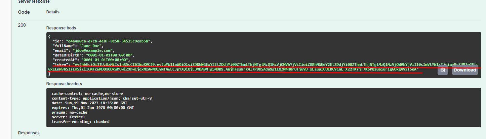
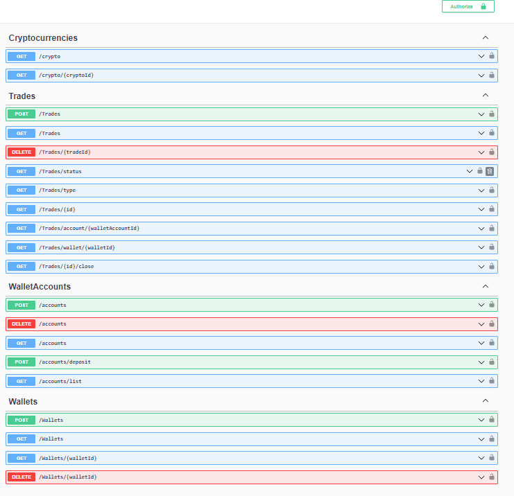
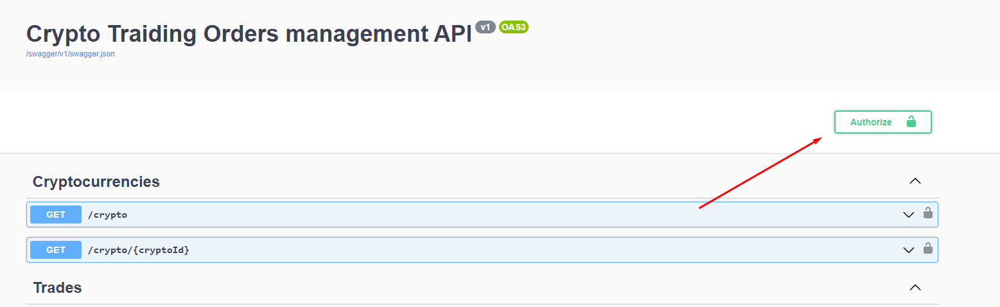
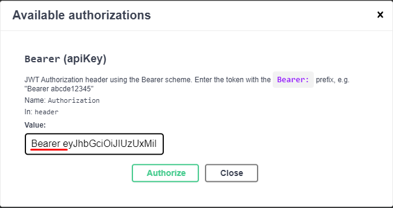

# Crypto Trading application

## Architecture

#### Implemented microservice architecture(as required).

- First microservice is used for managing user account. Implemented register, login and logout logic. Also user is able to delete account. After successful registration/login user gets JWT token that used to authenticating purpose

- Second microservice is used for managing trades. User is able to perform CRUD operation on wallet account, wallets(binds to wallet account) and trades. Besides CRUD operation with trades user is able to filter trades and close trades. Moreover user is able to see all cryptocurrencies in system or can see information about specific cryptocurrency. All operation, except cryptocurrency, is protected. User must be authenticated by JWT that generates by first microservice.

## Run application

To run application was used Docker, every microservice created as separate image, also for database used MS Sql image. To combine all used docker compose. So user need to download project and from root folder use command

`docker-compose up`

After that user is able to access the APIs by this url. For better user experience
in application using `Swagger`.

- `http://localhost:8081/index.html` - Account management API
- `http://localhost:8080/index.html` - Orders management API

## Small documentation

### Accounts management

Here is how user should see Accounts manager API

User is able to create own account. But also in application created several users for testing purpose. User can use any of them, all necessary date sore in `usersSeed.json`

After successful login(or registration), user can see token

This token is used for authentication on Orders management microservice.

### Orders Management

Here is how user should see Accounts manager API

As mentioned most of them is protected, except cryptocurrencies, so user have to use JWT token to authenticate. Be careful and don't forget to put Bearer prefix on authorize field

After that user is able to use Orders Management APIю
